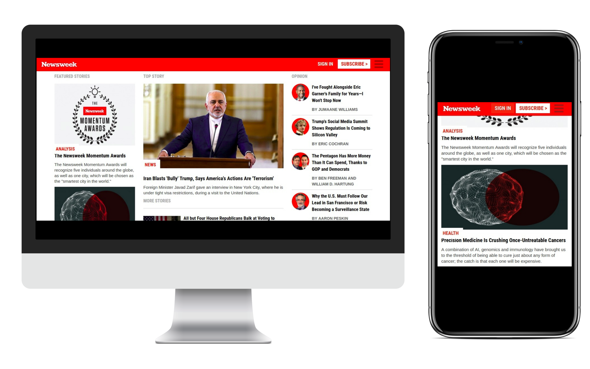

<h1 align="center">NewsWeek Clone</h1>

> This project consists in building a responsive clone of the User Interface of [NewsWeek's](https://www.newsweek.com/) website by using Bootstrap. The website is responsive for desktop, tablets and mobile.

### ✨ [Demo](https://raw.githack.com/vieiramanda11/newsweek-clone/developer/index.html)

## Tools used
  
  * HTML5
  * CSS3
  * Bootstrap

## Author

👤 **Amanda Vieira**

- Github: [@vieiramanda11](https://github.com/vieiramanda11)
- Twitter: [@mndvr_](https://twitter.com/mndvr_)
- Linkedin: [Amanda](https://www.linkedin.com/in/amandavieira23/)
- Email: [amandavieirazevedo@gmail.com]()
